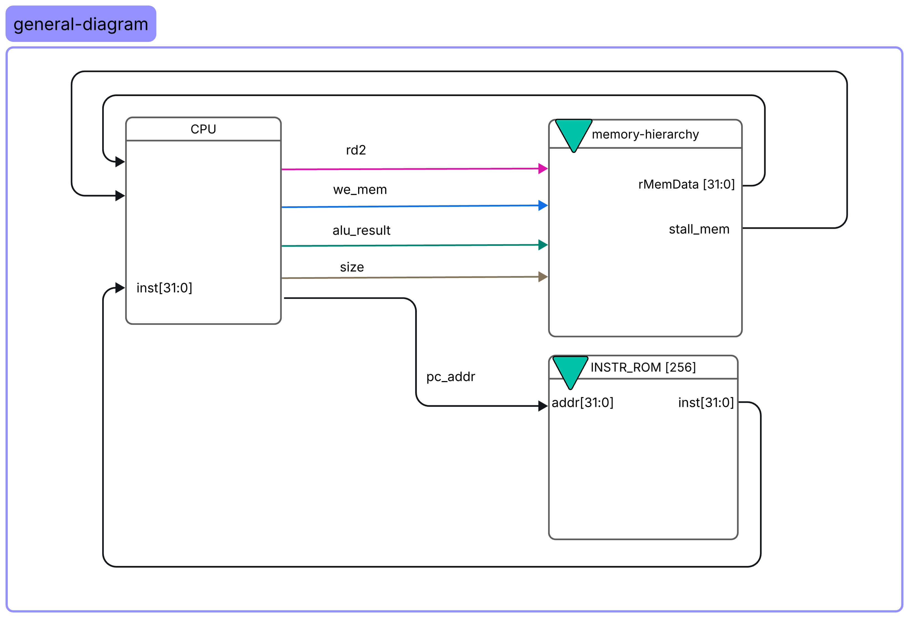
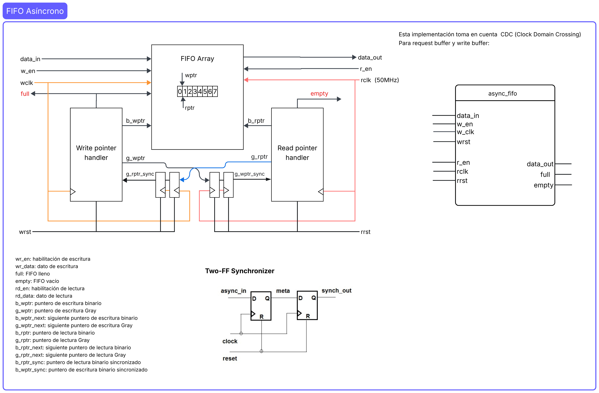
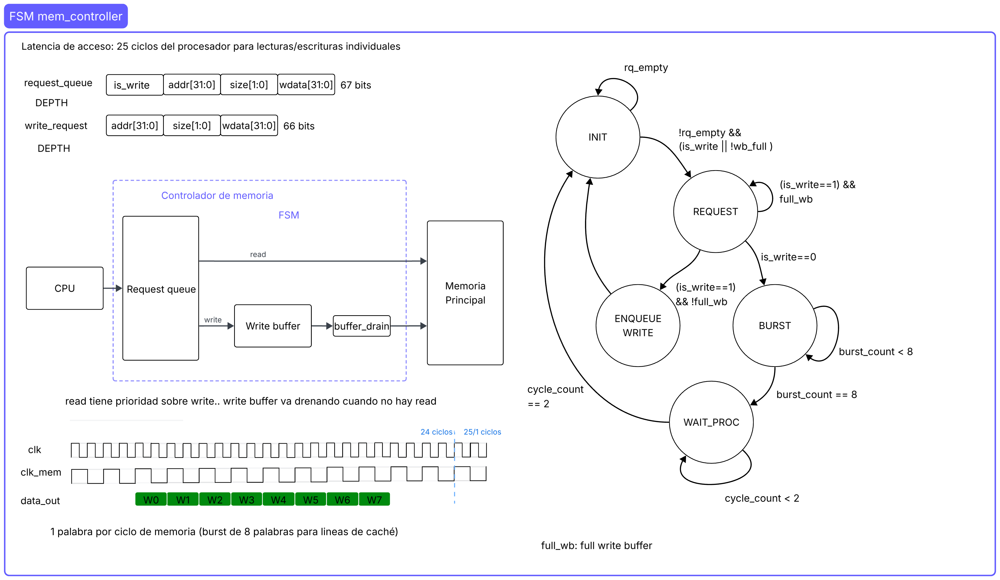
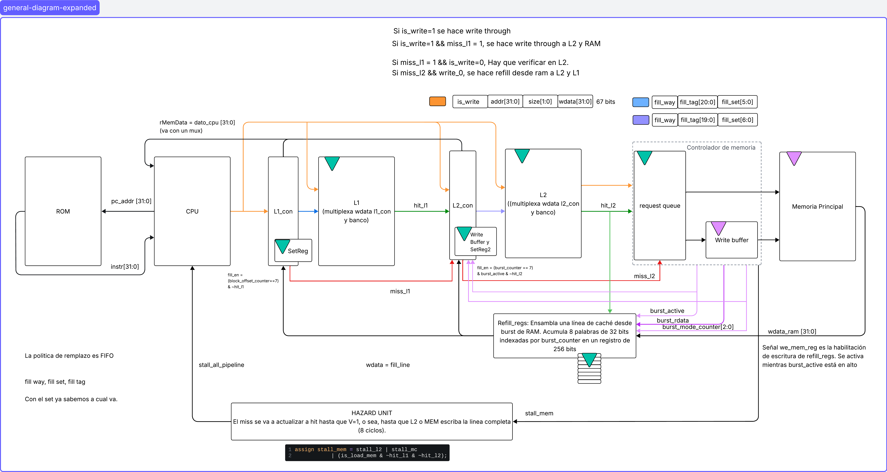
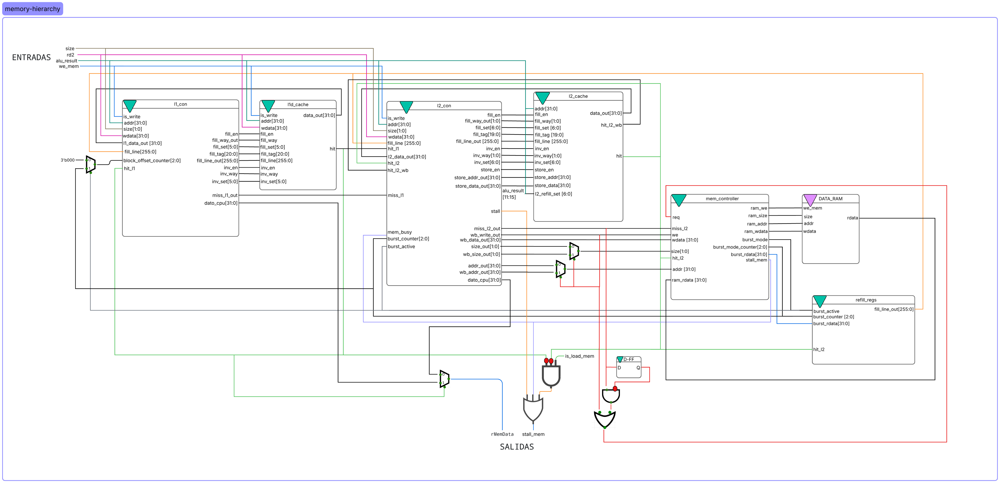
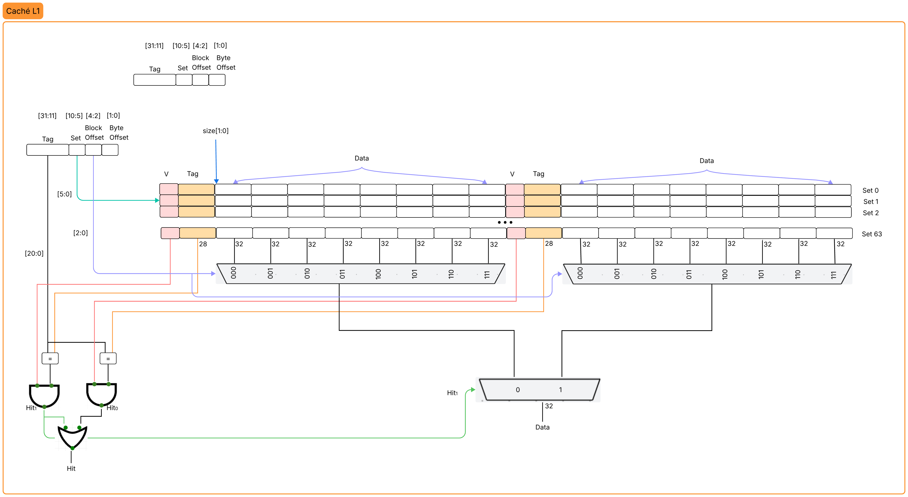
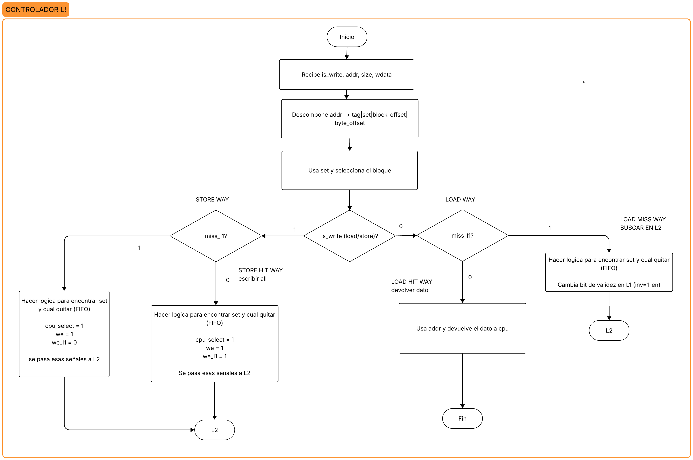
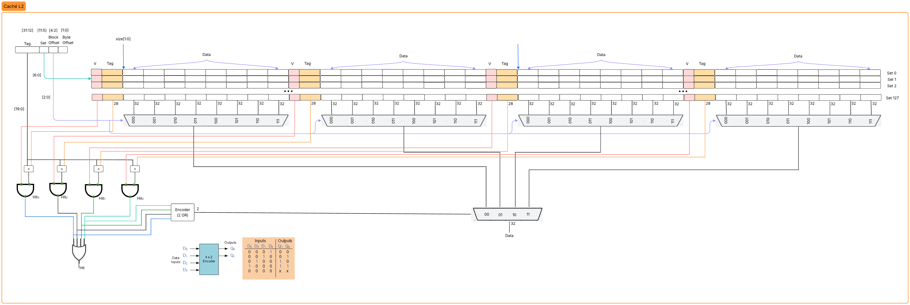
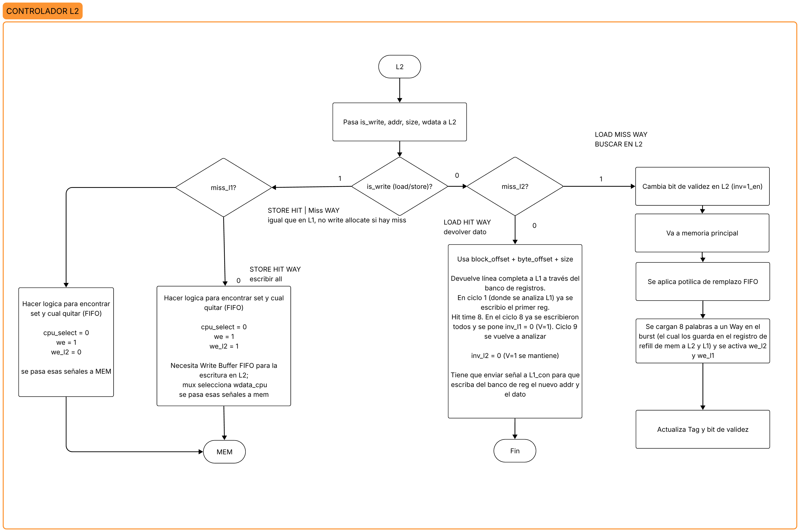

# Arquitectura de la jerarquía de memoria

- **Integrantes:**
Jafet Díaz Morales,
Ana Melissa Vásquez Rojas,
Adrián González Jiménez,
Fabricio González Cerdas,
Jian Zheng Wu
- **Curso:** CE-4301 Arquitectura de Computadores I
- **Proyecto:** Análisis de Impacto de Memoria Caché y Optimizaciones de Compilador en la Organización de Procesador Propio tipo RISC
- **Profesor:** Dr. Ing. Jeferson González Gómez

---

## Tabla de contenidos

1. [Diagrama de la jerarquía L1/L2](#diagrama-de-la-jerarquía-l1l2)
2. [Caché L1: políticas de escritura, reemplazo y parámetros](#caché-l1-decisiones-de-diseño-políticas-de-escritura-reemplazo-y-parámetros)
   - [Funcionamiento de caché L1-D con políticas elegidas](#funcionamiento-de-caché-l1-d-con-políticas-elegidas)
3. [Caché L2: políticas de escritura, reemplazo y parámetros](#caché-l2-decisiones-de-diseño-políticas-de-escritura-reemplazo-y-parámetros)
4. [Justificación técnica de políticas, reemplazo y parámetros configurables](#resumen-de-justificación-técnica-de-políticas-reemplazo-y-parámetros-configurables)
5. [Flujo de un acceso](#flujo-de-un-acceso)
6. [Integración con el pipeline del procesador](#integración-con-el-pipeline-del-procesador)
   - [Manejo de stalls de pipeline por misses](#manejo-de-stalls-de-pipeline-por-misses)
7. [Ordenamiento y coherencia](#ordenamiento-y-coherencia)
8. [Limitaciones conocidas](#limitaciones-conocidas)

---

Este documento describe el diseño de la jerarquia de cache de datos de Craft21
(Proyecto Grupal II), las decisiones de politica tomadas por el grupo y su
justificacion. Dicha jerarquía se acopla al procesador pipeline diseñado e implementado previamente. El diagrama general de la conexión se muestra a continuación:



Entre los cambios realizados se encuentra el hecho de que ahora la ROM de instrucciones es de acceso directo (1 ciclo, lectura en flanco negativo, sin misses), por lo que la jerarquia solo aplica a datos. La extensión para manejo de datos seguros del primer proyecto: la bóveda (neather_ram), no se toma en consideración para la jerarquía de memoria puesto que no será evaluado, por lo tanto es un camino aparte sin caché.

## Diagrama de la jerarquía L1/L2

La jerarquía de memoria está compuesta por dos niveles de caché previas a memoria principal. La memoria principal requiere de un controlador **mem_controller**, el cuál consiste de un bloque negro con varios módulos, entre ellos un FIFO asíncrono para el **Clock Domain Crossing** entre el el clock de `50MHz` de la memoria y el clock de `100MHz` del cpu. Otros módulos de la memoria son write buffer, FSM, lógica de burst, etc.

En general, la DRAM sigue funcionando de la misma forma que en lo previo cuando no era realista (latencia de 1 ciclo), el principal cambio consiste en el uso del nuevo clock y en el control que realiza la FSM para controlar el paso de los reads y los writes. Los reads consumen consumen una latencia de 24 ciclos y detienen el pipeline (stall) pero los writes se realizan en el background mediante el write buffer, el cuál a su vez contiene una etapa posterior de `drain` (controlada por la FSM) para que la latencia de la escritura sea de ~25 ciclos pero sin detener el pipeline (en caso de riesgo el compilador genera los nops necesarios).

Para mayor referencia del funcionamiento de la memoria principal realista, puede observar al diagrama de bloques de dicho diseño:





Ahora bien, la jerarquía de memoria incluye también a los dos niveles de caché previos a la DRAM. Previamente se incluye un diagrama general de las conexiones de CPU, ROM y Memory Hierarchy. Ahora, se muestra el mismo diagrama pero expandido de forma que se pueda ver más transparentemente (bloque parcialmente blanco):



Seguidamente, se muestra un diagrama donde se puede apreciar de forma específica cada entrada y salída de los módulos principales de la jerarquía de memoria (L1, L2, DRAM y sus respectivos controladores), siendo posible observar todos los buses de datos de entrada y salida internos.




Hay varios aspectos a explicar pues tanto la caché L1 como L2 (los principales enfoques de este proyecto) requirieron varias decisiones de diseño para poder ser implementadas, entre ellas: decisiones de implementación (diseño de FSMs y otros módulos relevantes), parámetros configurables, políticas de escritura y de reemplazo. Todos estos aspectos se explicarán a continuación en sus respectivas secciones

---

## Caché L1: Decisiones de diseño, políticas de escritura, reemplazo y parámetros

### 1. Resumen

La caché L1-D actúa como primer nivel de la jerarquía de memoria y es el único nivel de acceso completamente combinacional. Su objetivo es proveer el dato en el mismo ciclo en que `alu_result` está disponible (etapa MEM del pipeline), sin generar stall, aprovechando la localidad temporal y espacial del programa.

| Nivel | Tamaño | Asociatividad | Linea | Sets | Hit time |
|---|---|---|---|---|---|
| L1-D | 4 KB | 2-way | 32 B (8 palabras) | 64 | 1 ciclo (combinacional) |

- **Política de escritura:** Write-Through, No-Write-Allocate.
- **Política de reemplazo:** FIFO.

### División de la dirección — L1

```
L1:  | tag 21b [31:11] | set 6b [10:5] | word 3b [4:2] | byte 2b [1:0] |
```

---

### 2. Parámetros Configurables

| Parámetro | Valor | Símbolo |
|---|---|---|
| Tamaño de línea | 256 bits (32 bytes) | `LINE_BITS = 256` |
| Número de conjuntos | 64 | `SETS = 64` |
| Asociatividad | 2 vías | `WAYS = 2` |
| Capacidad total | 64 × 2 × 32 B = **4 KB** | — |
| Bits de set | 6 | `SET_BITS = 6` |
| Bits de offset (palabra) | 3 | `OFFSET_BITS = 3` |
| Bits de tag | 32 − 6 − 3 − 2 = **21** | `TAG_BITS = 21` |

#### Justificación de parámetros

En el enunciado del proyecto se indican los siguientes parámetros:

- **Tamaño:** 4 KB (1024 palabras de 32 bits)
- **Asociatividad:** 2-way set associative
- **Tamaño de línea:** 32 bytes = 256 bits (8 palabras)

Por estas razones, como parte del diseño se decidieron obtener ciertos parametros importantes:

```math
\#Bloques = \frac{Capacidad}{Tamaño\ de\ Línea} = \frac{4096\ B}{32\ B} = 128
```
```math
\#Sets = \frac{(\#Bloques)}{(\#Vías)} = \frac{128}{2} = 64
```
```math
\text{Bits de Set} = n,\ \text{con } 2^n = \#Sets = 2^6 = 64
```
```math
\text{Bits de Set} = n = 6\ bits
```
```math
\text{Bits de Block Offset} = b,\ \text{con } 2^b = \#\text{Palabras por Bloque} = 2^3 = 8
```
```math
\text{Bits de Block Offset} = b = 3\ bits
```

De esta forma, se obtuvo que:
- **Bits de Set:** 6
- **Bits de Block Offset:** 3
- **Bits de Byte Offset:** 2

La justificación de estos datos es puramente matemática y los valores no son arbitrarios sino la derivación de utilizar los valores solicitados por el enunciado.

La figura que se muestra a continuación presenta la organización de la caché L1-D diseñada para este proyecto.



### 3. Política de Escritura

#### Decisión: Write-Through + No-Write-Allocate

```
En un store:
  1. Si hay hit en L1: se actualiza la palabra en la vía correspondiente en el mismo ciclo.
  2. El dato SIEMPRE se envía al write buffer de l2_con (write-through).
  3. Si hay miss en L1: NO se asigna nueva línea (no-write-allocate).
     El store va directamente al write buffer de l2_con hacia L2/DRAM.
```

#### Justificación técnica

**Write-through** fue elegido sobre write-back por las siguientes razones:

- **Simplifica la coherencia L1-L2:** Con write-through, toda escritura en L1 se propaga inmediatamente a L2, garantizando que ambos niveles son consistentes en todo momento. No es necesario implementar un protocolo dirty-bit + writeback al desalojar líneas de L1, lo que simplifica la implementación y diseño.
- **Elimina el estado "dirty":** El bit `valid` es suficiente por línea; no se requiere bit `dirty`. Al no existir el estado sucio, el reemplazo de una línea no requiere ninguna escritura adicional, lo que mantiene la ruta combinacional de 1 ciclo.
- **Simplifica el remplazo:** Al reemplazar una línea de L1, basta con marcarla como inválida; L2 ya posee la copia actualizada del dato, por lo que no se requiere ninguna escritura de vuelta al nivel inferior.
- **Adecuado para el patrón de acceso del benchmark:** Los benchmarks de CRAFT21 presentan más loads que stores; el costo adicional de write-through (latencia de store hacia L2) no domina el CPI total.

**No-write-allocate** define qué ocurre ante un miss de escritura: el bloque no se carga en L1 y la escritura se envía directamente al nivel inferior vía `l2_con`. Las ventajas de esta política para este diseño son:

- Reduce el tráfico de refill: No se carga un bloque completo desde L2 (8 ciclos) para alojar un solo store que quizá no se vuelva a leer en L1.
- Preserva la capacidad de L1 para loads: El espacio se reserva para datos con alta probabilidad de reutilización, maximizando el impacto del hit time de 1 ciclo sobre el CPI.
- Sin penalización de stall: El store se entrega a `l2_con` en el mismo ciclo sin detener el pipeline, por lo que no alojar en L1 no introduce ninguna penalización en el flujo de ejecución.
- Implementación más simple: No se requiere lógica de refill en el path de escritura; el store miss simplemente drena por el write buffer.

#### Trade-off reconocido

La principal desventaja es que si el programa accede a la misma dirección poco después del store (write-then-read), ese load producirá un miss en L1 por no haberse cargado el bloque previamente, aumentando la latencia de accesos posteriores. Para los benchmarks actuales este patrón no es el caso dominante, por lo que la política no representa un problema significativo.

---

### 4. Política de Reemplazo

#### Decisión: FIFO (First-In, First-Out)

Cada conjunto de 2 vías mantiene un puntero de 1 bit (`fifo_ptr`, implementado en `set_reg.sv`) que indica la vía más antigua, es decir, la próxima en ser reemplazada. El puntero alterna únicamente al cargar una nueva línea (miss); los hits no lo modifican.

```
Estado inicial:   fifo_ptr = 1'b0  (reemplazar W0 primero)

Secuencia de fills en un conjunto:
  Fill #1 -> escribe W0, fifo_ptr <- 1
  Fill #2 -> escribe W1, fifo_ptr <- 0  (ciclo completo)
  Fill #3 -> escribe W0 (desaloja la línea más antigua), fifo_ptr <- 1
```

#### Justificación técnica

- En una organización asociativa de dos vías, FIFO y LRU presentan un comportamiento equivalente. Tras cada acceso, la línea a reemplazar coincide tanto con la más antigua como con la menos recientemente utilizada, por lo que la elección de FIFO no implica una degradación del hit rate respecto a LRU en este nivel de caché.

- La política FIFO requiere únicamente un bit por conjunto para identificar la próxima vía a reemplazar, lo que representa un total de 64 bits de almacenamiento adicional. A diferencia de LRU, no es necesario mantener información sobre la antigüedad de uso de las líneas ni actualizar el estado de reemplazo en cada acceso exitoso (hit), reduciendo así la complejidad del hardware.

- La caché L1 debe proporcionar los datos en un único ciclo dentro de la etapa MEM del pipeline. Debido a que FIFO no modifica su estado durante un hit, no introduce lógica adicional en el camino de lectura. En contraste, una implementación LRU requiere actualizar información de reemplazo en cada acceso exitoso, aumentando la lógica.


#### Trade-off reconocido

FIFO no se ajusta de forma dinámica a cambios en los patrones de acceso. En aplicaciones que alternan entre diferentes conjuntos de trabajo (working sets), la política puede reemplazar líneas que aún resultan útiles, ya que la decisión de reemplazo se basa únicamente en el orden de llegada y no en el historial reciente de uso. No obstante, dado que la caché L1 cuenta con solo dos vías, el impacto de esta limitación es reducido. 

---

## 5. Arquitectura de Control L1

A diferencia de L2, cuyo controlador se implementa mediante una máquina de estados finitos (FSM), el controlador de L1 está compuesto principalmente por lógica combinacional. 

---

### 5.0 Flujo conceptual del controlador L1

El siguiente diagrama ilustra el flujo de decisión de alto nivel del controlador. Se trata de una representación conceptual del comportamiento de l1_con ante accesos de lectura y escritura, tanto en condiciones de hit como de miss. Con el fin de mantener la claridad del diagrama, se omiten algunas señales de control y detalles específicos de implementación que se describen posteriormente en esta sección.



En el caso de un Store Hit, la palabra se actualiza en la vía correspondiente durante el mismo ciclo de reloj, siguiendo una política write-through. Simultáneamente, la operación de escritura se reenvía al write buffer gestionado por l2_con.

Ante un Store Miss, la escritura se envía directamente al write buffer sin provocar la carga de una nueva línea en la caché.

Para un Load Hit, el dato solicitado se obtiene directamente desde L1 y la señal dato_cpu se resuelve de forma combinacional dentro del mismo ciclo, evitando detener (stall) el procesador.

Finalmente, cuando ocurre un Load Miss, el procesador se detiene mientras l2_con mientras se obtiene el bloque de memoria principal. Una vez completado el burst de DRAM y recibida la última palabra del bloque, inv_en invalida la línea actualmente almacenada en el conjunto correspondiente. En el ciclo siguiente, fill_en habilita la escritura de la nueva línea completa en L1, restaurando la operación normal del procesador.

---

### 5.1 Señal de llenado (`fill_en`)

```verilog
fill_en_comb = (block_offset_counter == 3'b111) & ~hit_l1 
always_ff @(posedge clk) 
  fill_en <= fill_en_comb & ~hit_l1 // retrasado 1 ciclo
```

La señal `fill_en_comb` se activa cuando el *burst* de DRAM transfiere la última palabra del bloque (`block_offset_counter == 3'b111`) y existe un miss activo en L1. Esta condición indica que el bloque completo ha sido recibido y está listo para ser escrito en la caché.

La activación de `fill_en` se pospone hasta el ciclo posterior a la recepción de la última palabra del bloque. Esto garantiza que el contenido de `fill_line` incluya las ocho palabras válidas antes de iniciar la escritura de la nueva línea en L1. Sin esta separación temporal, el llenado podría ejecutarse antes de que la actualización de `refill_regs` se refleje completamente en el bloque ensamblado.

---

### 5.2 Señal de invalidación (`inv_en`)

```verilog
always_ff @(posedge clk)
    fill_en_comb_d <= fill_en_comb;

inv_en = fill_en_comb & ~fill_en_comb_d & ~hit_l1 & ~is_write
```

La señal `inv_en` se genera mediante detección de flanco de subida sobre `fill_en_comb`. Para ello, se compara el valor actual de la señal con su versión registrada (`fill_en_comb_d`), produciendo un pulso de un único ciclo cuando se completa la recepción del bloque.

Este mecanismo garantiza que la invalidación se complete antes de la operación de llenado (*fill*), evitando cualquier conflicto entre ambas acciones. La invalidación se aplica únicamente ante misses de lectura (`~is_write`), ya que las escrituras siguen una política *no-write-allocate* y, por lo tanto, no requieren cargar nuevas líneas en L1.


---

### 5.3 Puntero de reemplazo FIFO (`WayReg`)

```verilog
replace = fill_en | (is_write & hit_l1)

set_reg #(.NUM_SETS(64), .NUM_WAYS(2)) WayReg (
    .set(addr_set), .fill_en(replace), .way_out(way_to_fill)
)
```

El módulo `WayReg` implementa el mecanismo de selección de vía mediante un puntero FIFO asociado a cada set. Su señal de actualización, denominada `replace`, provoca que el puntero del set indexado avance a la siguiente vía en orden circular.

La lógica de control de L1 genera `replace` a partir de la señal de llenado (`fill_en`) y de la condición de *store hit* (`is_write & hit_l1`). Como resultado, el mecanismo de reemplazo se actualiza tanto durante los llenados como durante las escrituras que impactan en la caché.


## Caché L2: Decisiones de diseño, políticas de escritura, reemplazo y parámetros

### 1. Resumen

La caché L2 actúa como nivel de respaldo para la L1D. Su objetivo es absorber los misses de L1 antes de recurrir a la DRAM principal, reduciendo la penalización de latencia de acceso.

| Nivel | Tamaño | Asociatividad | Linea | Sets | Hit time |
|---|---|---|---|---|---|
| L2 | 16 KB | 4-way | 32 B | 128 | 8 ciclos (FSM) |
| RAM | 64 KB | — | burst de 8 palabras | — | ~25 ciclos del procesador |

- **Política de escritura:** El grupo definió Write Through, No-Write-Allocate.
- **Política de reemplazo:** El grupo definió FIFO.

### División de la dirección — L2

```
L2:  | tag 20b [31:12] | set 7b [11:5] | word 3b [4:2] | byte 2b [1:0] |
```
 
---
 
### 2. Parámetros Configurables
 
| Parámetro | Valor | Símbolo |
|---|---|---|
| Tamaño de línea | 256 bits (32 bytes) | `LINE_BITS = 256` |
| Número de conjuntos | 128 | `SETS = 128` |
| Asociatividad | 4 vías | `WAYS = 4` |
| Capacidad total | 128 × 4 × 32 B = **16 KB** | — |
| Bits de índice | 7 | `INDEX_BITS = 7` |
| Bits de offset (palabra) | 3 | `OFFSET_BITS = 3` |
| Bits de tag | 32 − 7 − 3 − 2 = **20** | `TAG_BITS = 20` |

#### Justificación de parámetros
 
En el enunciado del proyecto se indican los siguientes parámetros:

- **Tamaño:** 16 KB (4096 palabras de 32 bits, simulable en Icarus Verilog)
- **Asociatividad:** 4-way set associative
- **Tamaño de línea:** 32 bytes = 256 bits (8 palabras)

Por estas razones, como parte del diseño se decidieron obtener ciertos parametros importantes: 

```math
\#Sets = \frac{(\#Bloques)}{(\#Vías)} = \frac{512}{4} =  128
```
```math
\text{Bits de Sets} = n, \text{con } 2^n = \#Sets = 2^7= 128
```
```math
\text{Bits de Set} = n = 7 bits
```
```math
\text{Bits de Block Offset} = b, \text{con } 2^b = \#\text{Palabras por Bloque} = 2^3 = 8
```
```math
\text{Bits de Block Offset} = b = 3 bits
```

De esta forma, se obtuvo que:
- **Bits de Set:** 7
- **Bits de Block Offset:** 3
- **Bits de Byte Offset:** 2

La justificación de estos datos es puramente matemática y los valores no son arbitrarios sino la derivación de utilizar los valores solicitados por el enunciado. 

La figura que se muestra a continuación presenta la organización de la caché L2 diseñada para este proyecto.



### 3. Política de Escritura
 
#### Decisión: Write-Through + No-Write-Allocate
 
```
En un store, si la dirección no está, entonces no es necesario:
  1. Se escribe directamente en DRAM (vía write buffer).
  2. Si hay hit en L2: se actualiza también el dato en L2.
  3. Si hay miss en L2: NO se asigna nueva línea (no-write-allocate).
```
 
#### Justificación técnica
 
**Write-through** fue elegido sobre write-back por las siguientes razones:
 
- **Simplifica la coherencia L1-L2:** Con write-through, L2 siempre contiene datos ≥ tan recientes como L1. No es necesario implementar un protocolo dirty-bit + writeback al desalojar líneas de L1, lo que simplifica la implementación y diseño.
- **Elimina el estado "dirty":** El bit `valid` es suficiente por línea; no se requiere bit `dirty`. Esto reduce el área del array de tags, simplifica la decodificación y reduce las variables necesarias a considerar en FSM del controlador.
- **Reduce la complejidad del reemplazo:** Al desalojar una línea de L2, nunca es necesario escribirla de vuelta a DRAM, porque DRAM ya tiene la versión actualizada.
- **Adecuado para el patrón de acceso del benchmark:** Se identificó que en general, los stores en los benchmarks de CRAFT21 son poco frecuentes comparados con los loads; el costo extra de write-through (latencia de store) no domina el CPI total. Además, se apuesta a que el principio de que si el dato no está, no necesita escribirse en L2 pero si en DRAM para mantener la coherencia.

**No-write-allocate** complementa write-through:
 
- Un store que produce miss en L2 es poco probable que sea seguido de un load a la misma dirección en el corto plazo (patrón write-only).
- Traer una línea completa solo para escribir un word desperdiciaría ancho de banda L2↔DRAM.
- Los stores drenan por el **write buffer** en background, sin bloquear el pipeline para fetches de instrucción.

#### Trade-off reconocido
 
Se es consciente de las desventajas de esta decisión técnica. Si el programa tiene muchos stores seguidos de loads a la misma región (write-then-read), no-write-allocate penaliza los loads subsiguientes. Para los benchmarks actuales esto no es el caso dominante, por lo que la política no representa un un problema significativo.
 
---
 
### 4. Política de Reemplazo
 
#### Decisión: FIFO (First-In, First-Out)
 
Cada conjunto de 4 vías mantiene un puntero de 2 bits (`fifo_ptr`) que indica la vía más antigua, es decir, la próxima en ser reemplazada. El puntero avanza en orden circular únicamente al cargar una nueva línea (miss); los hits no lo modifican.
 
```
Estado inicial:   fifo_ptr = 2'b00  (reemplazar W0 primero)
 
Secuencia de fills en un conjunto:
  Fill #1 → escribe W0, fifo_ptr ← 01
  Fill #2 → escribe W1, fifo_ptr ← 10
  Fill #3 → escribe W2, fifo_ptr ← 11
  Fill #4 → escribe W3, fifo_ptr ← 00  (ciclo completo)
  Fill #5 → escribe W0 (desaloja la línea más antigua), fifo_ptr ← 01
```
 
#### Justificación técnica
 
**Simplicidad de implementación:** FIFO requiere únicamente un contador de 2 bits por conjunto (`128 × 2 = 256 bits` en total para los punteros). No necesita comparadores de edad ni actualizaciones en cada hit, a diferencia de LRU. Además, es ventajoso por sobre una política Random puesto que sería más díficil y se considera ineficiente porque los benchmarks no presentan accesos aleatorios sino que se aplican conceptos de localidad espacial y temporal.
 
**Sin actualizaciones en hit:** A diferencia de LRU, un hit en L2 no modifica ningún estado de reemplazo. Esto reduce la complejidad del datapath de control en `l2_con.sv` — solo los misses (estados `FILL`) tocan `fifo_ptr`.
 
**Determinismo de simulación:** El orden de reemplazo es completamente predecible a partir de la secuencia de misses, lo que facilita la verificación del comportamiento con testbenches basados en `$readmemh` y contadores de ciclo.

**Costo de hardware:** Solo 256 bits adicionales de estado (los punteros), frente a los ~640 bits que requeriría LRU exacto con codificación de permutaciones para 4 vías.
 
#### Trade-off reconocido
 
FIFO es susceptible a la **anomalía de Bélády**: aumentar la asociatividad puede incrementar la tasa de misses para ciertos patrones de acceso cíclico. Sin embargo, con 4 vías y los patrones de acceso actuales de CRAFT21, este caso no se manifiesta mayoritariamente. Si se detectara degradación en futuros benchmarks con mayor localidad temporal, una migración a pseudo-LRU sería el siguiente paso natural.
 
---
 
## 5. Arquitectura de Control L2: Dos FSMs Independientes
 
`l2_con.sv` contiene dos máquinas de estado que operan en paralelo: una para loads y otra para el drenado del write buffer.
 
---
 
### 5.0 Flujo conceptual del controlador L2
 
El siguiente diagrama muestra el flujo de decisión de alto nivel del controlador. Es una vista conceptual — en el código real, las rutas se implementan mediante las dos FSMs descritas en 5.1 y 5.2.



De este diagrama se pueden hacer ciertas aclaraciones:

En el camino de Store Miss se realiza no-write-allocate, solo se escriba en memoria. En el camino de Store Hit, se escribe en L2 y en Memoria. En el camino de Load Hit, se devuelve el dato usando offset de dirección. En el camino Load Miss ocurren varias cosas: 

1. Se activa `inv_en`, para lo cuál se utiliza el FIFO ptr para determinar la vía a reemplazar. 
2. Acceso a DRAM donde en el burst de 8 palabras se escribe la línea completa en un set de registros auxiliar (refill_regs). 
3. Se activa `fill_en` en el ciclo posterior a que `burst_count ==7` de forma tal que se escriba en la línea invalidad de L2 el dato del set de registros auxiliar. A su vez, se envía señal a L1 para que también haga refill.
4. Se actualiza el bit de validez. Se avanza el puntero del FIFO.
 
**Aclaraciones respecto al diagrama conceptual original:**
 
- **"Hit time 8 / ciclo 9 se vuelve a analizar":** En el código, esto corresponde a `load_cnt >= 7 && hit_l2` dentro de `ACCESS`. Los 8 ciclos son el hit-time fijo; el re-análisis es la evaluación de `hit_l2` en el último ciclo del contador antes de transicionar a `DONE`.
- **`inv_l2 = 0 (V=1 se mantiene)` en el path de hit:** El diagrama refleja que en un load hit, `inv_en` permanece desasertado (`inv_en` solo pulsa en la transición `IDLE→ACCESS` con `~hit_l2`). La línea válida no se toca.
- **"Devuelve línea completa a L1 a través del banco de registros":** En el código, esto es `fill_line` (acumulada en `refill_regs`) pasada como `fill_line_out` hacia `l2_cache` y de ahí propagada a `l1_con`. El write buffer de stores es independiente de este path.
- **STORE MISS / no-write-allocate:** El diagrama lo muestra como `we_l2 = 0`. En el código, un miss de store simplemente no activa `fill_en` ni `store_en` — el dato va directo al write buffer (`wb_push`) y de ahí a MEM vía `WB_COMMIT`.
---
 
### 5.1 FSM Load (`load_state`)

Se implementó la siguiente FSM:

```
      rq_empty=0 & wb_empty              load_cnt>=7 & hit_l2
          ┌──────────────────┐         ┌──────────────────────┐
          ▼                  │         │                       ▼
        IDLE ──────────────► ACCESS ───┤                     DONE ──► IDLE
                                       │                       ▲       (cuando ~burst_active)
                                       └──────────────────────►┘
                                          fill_en (miss: burst completo)
```
 
| Estado | Condición de salida | Descripción |
|---|---|---|
| `IDLE` | `!rq_empty && wb_empty` | Espera un load encolado; bloquea si el WB no está vacío (orden RAW) |
| `ACCESS` | `load_cnt >= 7 && hit_l2` → `DONE` | Hit: tiempo de acceso fijo de 8 ciclos (`load_cnt` 0→7) |
| `ACCESS` | `fill_en` → `DONE` | Miss: espera hasta que el burst de DRAM complete y `fill_en` se aserte |
| `DONE` | `~burst_active` → `IDLE` | Espera a que el burst termine antes de liberar la FSM |
 
El estado `ACCESS` no tiene un contador fijo para misses; en cambio espera la señal `fill_en`. Esto es necesario porque el burst de DRAM tiene latencia variable. Salir a ciclo fijo causaba que la FSM popeara el request antes de que el dato llegara a L2, generando loads duplicados cuyos bursts tardíos sobreescribían líneas válidas en L1.
 
La FSM no entra a `ACCESS` mientras el write buffer tenga entradas pendientes. Esto preserva el orden read-after-write hacia DRAM: si un store previo aún no se ha drenado, un load a la misma dirección podría leer el valor viejo de RAM.
 
---
 
### 5.2 FSM Write Buffer Drain (`wb_state`)
 
```
      wb_empty=0 & load_state≠ACCESS & ~fill_en        wb_cnt==6 & ~mem_busy
          ┌──────────────────────────────┐            ┌───────────────────────┐
          ▼                              │            │                       ▼
       WB_IDLE ───────────────────────► WB_DRAIN ────┘                  WB_COMMIT ──► WB_IDLE
```
 
| Estado | Condición de salida | Descripción |
|---|---|---|
| `WB_IDLE` | `!wb_empty && load_state != ACCESS && ~fill_en` | Espera stores pendientes; bloqueada durante ACCESS y fill |
| `WB_DRAIN` | `wb_cnt == 6 && !mem_busy` | Latencia de drenado de 7 ciclos; reintenta si `mem_busy` |
| `WB_COMMIT` | incondicional → `WB_IDLE` | Emite `wb_write_out`, `wb_pop`, `store_en` si hay hit en L2 |
 
La FSM de drenado se inhibe mientras `load_state == ACCESS` o mientras `fill_en` está activo. Esto evita que un commit al `mem_controller` colisione con un burst de refill en vuelo, lo cual corrompería el orden de transacciones en el bus de memoria.
 
Si el `mem_controller` tiene su cola llena (`mem_busy = 1`), `WB_DRAIN` no avanza a `WB_COMMIT`. Sin esta guarda, el commit ocurriría con la cola llena y la escritura se perdería silenciosamente.
 
`fill_en` se genera registrando la detección de `burst_counter == 7`. El delay de un ciclo es necesario porque en el ciclo donde llega la última palabra del burst, `refill_regs` aún está capturándola (su `always_ff` escribe en el mismo flanco). Sin el registro, `fill_line_out[255:224]` tendría el valor anterior y L2 almacenaría una línea parcialmente corrompida.
 
La invalidación de la línea víctima en L2 se aserta únicamente en el ciclo exacto de transición `IDLE → ACCESS`, y solo cuando hay miss. Mantener `inv_en` activo durante todo `ACCESS` borraría la línea recién escrita por el fill.

Cuando `l2_con` completa un fill, señaliza a `l1_con` para invalidar la línea old y escribir la nueva. Un bug de integración encontrado fue que `inv_en` se mantenía activo durante todo el estado de miss, borrando la línea recién escrita. 

La solución consistía en la detección de flanco en `inv_en`: La invalidación se ejecuta solo en el ciclo exacto del pulso, no durante todo el período activo de `inv_en`.
 
---
 
### 5.3 Cola de Requests (Request Queue)
 
Los misses de loads en L1D se encolan en una `sync_fifo` antes de ser procesados por `l2_con`:
 
- **Profundidad:** 8 entradas
- **Ancho:** dirección de 32 bits + metadatos de transacción

`PTR_BITS'(DEPTH)` con `DEPTH=8` y `PTR_BITS=3` produce `3'(8) = 3'b000 = 0`, haciendo que `full == empty` desde el reset — la FIFO aparece simultáneamente llena y vacía. Usar `COUNT_BITS = PTR_BITS + 1 = 4` evita el truncamiento silencioso del literal de SystemVerilog. Esta es una limitación conocida de Icarus Verilog con casting de constantes.
 
#### Gating de `rq_push` durante ACCESS/DONE
 
Cuatro condiciones combinadas garantizan exactamente un push por miss:
- `miss_l1 & ~is_write`: solo loads, los stores van al write buffer.
- `~rq_full`: no desborda la cola.
- `load_state == IDLE`: no encola mientras hay un request en vuelo.
- `rq_empty`: evita duplicados si el miss_l1 se mantiene sostenido durante el stall — sin esta guarda, cada ciclo de stall intentaría encolar la misma dirección.

---

## Resumen de Justificación técnica de políticas, reemplazo y parámetros configurables

| Decision | Eleccion | Justificacion |
|---|---|---|
| Escritura L1 | **Write-through** | Simplicidad de coherencia: L2 y RAM siempre tienen el dato. No requiere dirty bits ni eviction de lineas sucias. |
| Escritura L2 | **Write-through** (con autorizacion del profesor; el enunciado pedia write-back) | Uniformidad con L1 y simplicidad. El costo medido es alto trafico de escritura a RAM (ver analisis de rendimiento: 86-88% de utilizacion del bus). |
| Asignacion en write miss | **No-write-allocate** | Un store que falla no trae la linea: escribe hacia abajo. Combinacion clasica con write-through. |
| Reemplazo L1 y L2 | **FIFO** (puntero por set, `set_reg.sv`) | 1 contador chico por set, sin actualizacion en hits. Trade-off aceptado: puede expulsar lineas que LRU conservaria. |
| Write buffers | Request queue (8) y write buffer (8) en `l2_con`; cola asincrona (8) y write buffer (8) en `mem_controller` | Absorben los stores para que el pipeline no espere los ~25 ciclos de RAM por cada escritura. |

---

## Flujo de un acceso

**Load (lectura):**
1. Lookup combinacional en L1 con `alu_result`. Hit: dato en el mismo ciclo, sin stall.
2. Miss en L1: el pipeline se congela (`stall_mem`). El load espera a que el
   write buffer de L2 drene (orden read-after-write) y se encola en la
   request queue de `l2_con`.
3. La FSM de L2 evalua `hit_l2`. Hit: el dato sale de L2 tras el hit time.
   Miss: se pide un burst de 8 palabras a `mem_controller`, que lee la linea
   completa de RAM (alineada a 32 B), la acumula en `refill_regs` y la
   escribe en L2 y L1. El load reintenta y acierta.

**Store (escritura):**
1. Si la linea esta en L1, se actualiza la palabra en L1 (mismo ciclo).
2. El store SIEMPRE se empuja al write buffer de `l2_con` (write-through),
   que lo drena hacia L2 (si hit) y hacia RAM via `mem_controller`.
3. El pipeline solo se detiene si el write buffer esta lleno (backpressure).

---

## Integración con el pipeline del procesador

La jerarquía de memoria ya explicada se integra con el pipeline del procesador de forma similar a como se muestra en los primeros diagramas de este documento MarkDown. Su integración es bastante similar y no varía mucho de iteraciones pasadas del proyecto debido a las pocas entradas y salidas que tiene. Si desea observar la organización/microarquitectura la integración en el pipeline puede observar el documento: [microarchitecture.md](microarchitecture.md)

### Manejo de stalls de pipeline por misses

- `stall_mem = stall_l2 | stall_mc | (load & ~hit_l1 & ~hit_l2)`: un load sin
  dato valido retiene IF/ID/EX/MEM/WB hasta que algun nivel lo tenga.
- Los flushes por branch se suprimen durante el stall y se aplican al
  liberarse (los registros de pipeline retienen su contenido mientras estan
  congelados).
- El dominio de RAM corre a 50 MHz (`clk_divider`); el cruce se hace con la
  cola asincrona del `mem_controller`.

---

## Ordenamiento y coherencia

Con write-through la coherencia entre niveles es directa (no hay lineas
sucias). El orden read-after-write se garantiza en dos puntos:

1. `l2_con`: un load no inicia su acceso mientras su write buffer tenga
   stores pendientes.
2. `fsm_memory`: una lectura no inicia su burst mientras el write buffer de
   memoria este drenando (`wb_conflict`).

Como ambos caminos comparten la request queue del `mem_controller` (FIFO),
las escrituras siempre llegan a RAM antes que la lectura que las sigue.

## Limitaciones conocidas

- El hit de L2 paga los 8 ciclos completos de la FSM aunque el dato este
  disponible antes (hit time fijo segun el enunciado).
- Dos stores consecutivos a la misma direccion: el filtro anti-duplicados
  del write buffer descartaria el segundo. El codigo generado por el
  compilador no produce ese patron.
- `burst_active` cruza de dominio sin sincronizador en la transicion
  DONE→IDLE de `l2_con` (funciona en simulacion; para sintesis se
  recomienda un sincronizador 2-FF).
- Los contadores de metricas viven en el testbench (medicion no invasiva),
  no en RTL.
