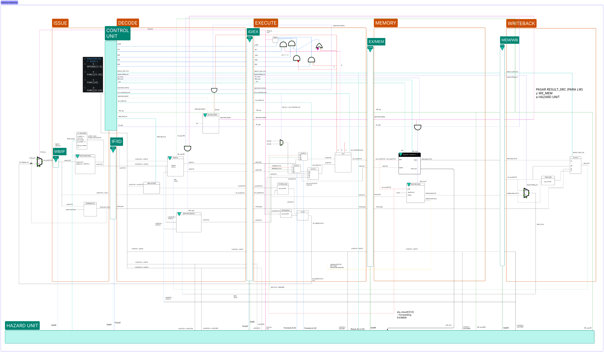

# Organizacion y microarquitectura de Craft21

Craft21 esta implementado en SystemVerilog como un procesador segmentado. La
organizacion interna se integra en `arqui/rtl/top.sv`, donde se conectan las
etapas de fetch, decode, execute, memory y writeback mediante registros de
pipeline. El diseno incluye banco de registros general, ALU, unidad de control,
RAM de datos, ROM de instrucciones y una boveda de llaves compuesta por banco de
registros Vault, RAM Vault y control de Secure Mode.



## Vista general del datapath

La ruta principal del procesador sigue este flujo:

```text
Fetch/Issue -> IF/ID -> Decode -> ID/EX -> Execute -> EX/MEM
            -> Memory -> MEM/WB -> Writeback
```

El PC avanza normalmente con `PC + 4`. Si una instruccion de salto, branch o
portal cambia el flujo, la etapa execute calcula el destino y writeback
selecciona el siguiente valor de PC. Esa direccion vuelve a `issue.sv` como
`new_addr`.

## Componentes principales

| Componente | Modulo SystemVerilog | Descripcion |
| --- | --- | --- |
| Modulo superior | `top.sv` | Interconecta todas las etapas, senales de control y registros de pipeline. |
| Fetch / Issue | `issue.sv` | Actualiza el PC, lee la ROM de instrucciones y calcula `PC + 4`. |
| PC | `pc.sv` | Registro del contador de programa con `reset` y `pc_enable`. |
| ROM de instrucciones | `instr_rom.sv` | Carga `programs/program.hex` y entrega instrucciones de 32 bits. |
| IF/ID | `if_id_pipe.sv` | Registra instruccion, PC actual y PC+4. |
| Decode | `decode.sv` | Decodifica la instruccion, lee registros, extiende inmediatos y maneja Secure Mode. |
| Unidad de control | `control_unit.sv` | Genera senales de control a partir de `opcode` y campos `func`. |
| Banco de registros | `regfile.sv` | Implementa 32 registros generales de 32 bits. |
| Banco Vault | `neather_regfile.sv` | Implementa 32 registros protegidos de boveda. |
| ID/EX | `id_ex_pipe.sv` | Registra operandos, inmediato, PC y senales de control. |
| Execute | `execute.sv` | Selecciona operandos, ejecuta ALU y resuelve control de flujo. |
| ALU | `alu.sv` | Ejecuta operaciones aritmeticas, logicas, shifts, comparacion, multiplicacion y division. |
| EX/MEM | `ex_mem_pipe.sv` | Registra resultado de ALU, datos de store y control de memoria. |
| Memory stage | `memory.sv` | Conecta la RAM normal y la RAM Vault. |
| RAM normal | `data_ram.sv` | Memoria de datos de 64 KiB organizada por bytes. |
| RAM Vault | `neather_ram.sv` | Memoria protegida para llaves y valores sensibles. |
| MEM/WB | `mem_wb_pipe.sv` | Registra valores provenientes de memoria o ALU para writeback. |
| Writeback | `writeback.sv` | Selecciona resultado final, escribe registros y calcula el siguiente PC. |

## Fetch / Issue

La etapa `issue.sv` contiene la logica de busqueda de instrucciones:

- `pc.sv` guarda la direccion actual. En reset inicia en `0`. Si `pc_enable`
  esta activo, carga `new_addr`.
- `instr_rom.sv` lee instrucciones de 32 bits desde `programs/program.hex`.
  Usa `addr[31:2]`, porque las instrucciones estan alineadas a palabra.
- `sumador_pc.sv` calcula `PC + 4`.
- `pc_decoder.sv` puede deshabilitar el avance del PC ante instrucciones como
  `freeze`.

Las salidas de fetch son `instrF`, `pcF` y `pc4F`, que pasan al registro
`if_id_pipe.sv`.

## Decode

La etapa `decode.sv` recibe la instruccion estable desde IF/ID. Alli se separan
los campos de la instruccion y se generan las senales de control. La unidad de
control recibe:

| Campo | Bits | Uso |
| --- | --- | --- |
| `opcode` | `instr[3:0]` | Selecciona familia de instruccion. |
| `func23` | `instr[23:20]` | Parte alta de funcion para ALU/branch/Vault. |
| `func19` | `instr[19]` | Bit de funcion para loads/stores, jumps y Vault. |
| `func15` | `instr[15:14]` | Funcion de inmediatos tipo I/IV. |

`control_unit.sv` produce senales como `alu_control`, `we_reg`, `we_mem`,
`size`, `result_src`, `alu_src`, `beq`, `bne`, `blt`, `bge`, `jump`, `w_regv`,
`w_memv`, `neather_portal`, `neather_reset` y `neather_wreg_src`.

El banco general `regfile.sv` tiene dos puertos de lectura combinacional y un
puerto de escritura secuencial. La escritura a `x0` se bloquea, por lo que `x0`
funciona como cero cableado. El modulo incluye bypass local cuando una lectura y
una escritura apuntan al mismo registro en el mismo ciclo.

La extension de inmediatos se implementa en `imm_extend.sv`. Este bloque
reconstruye inmediatos para instrucciones tipo I, S, B y J, con extension de
signo o extension con ceros segun corresponda.

## Boveda de llaves y Secure Mode

La boveda de llaves separa valores sensibles del banco general. Esta formada por
tres bloques:

| Bloque | Modulo | Funcion |
| --- | --- | --- |
| Secure Mode | `secure_mode.sv` | Guarda si el procesador esta en modo seguro. |
| Registros Vault | `neather_regfile.sv` | Banco de registros `v0-v31`. |
| RAM Vault | `neather_ram.sv` | Memoria protegida cargada desde `programs/neather.hex`. |

La escritura al banco Vault se habilita solo si Secure Mode esta activo:

```systemverilog
assign we_regV = w_regvWB & neather_modeWB;
```

La escritura a RAM Vault sigue la misma idea:

```systemverilog
assign we_memv_aux = w_memv & neather_mode_aux;
```

Con esta interconexion, instrucciones normales no pueden modificar registros o
memoria Vault. `portalv` habilita el modo seguro cuando la validacion es
correcta y `closev` lo cierra.

## Execute

La etapa `execute.sv` recibe operandos y senales de control desde
`id_ex_pipe.sv`. Sus responsabilidades son:

- seleccionar el segundo operando de la ALU;
- ejecutar la operacion indicada por `alu_control`;
- producir banderas de condicion;
- calcular targets de branch/jump;
- generar `pc_srcEx`, que indica si se debe tomar un nuevo PC.

El segundo operando de la ALU se selecciona con `alu_src`:

| `alu_src` | Fuente |
| --- | --- |
| `00` | `rd2E`, segundo registro general. |
| `01` | Constante auxiliar para TEA, seleccionada entre 4 y 5. |
| `10` | `rdv2E`, dato leido del banco Vault. |
| `11` | `immE`, inmediato extendido. |

La ALU (`alu.sv`) soporta `add`, `sub`, `sll`, `slt`, `xor`, `srl`, `sra`,
`or`, `and`, `mul` y `div`. Tambien genera las banderas `z_flag`, `n_flag` y
`v_flag`. Estas banderas alimentan la logica de branches para instrucciones
como `beq`, `bne`, `blt` y `bge`.

Para control de flujo se calculan dos direcciones:

- `pc_relative_target = pc_actE + immE`, usado por branches y `jal`.
- `jalr_target = rd1E + immE`, usado por `jalr`.

Luego se selecciona el destino correcto y se propaga hacia writeback como
`pc_targetEX`.

## Memory stage

La etapa `memory.sv` usa el resultado de la ALU como direccion efectiva. Dentro
de esta etapa se instancian dos memorias:

| Memoria | Modulo | Acceso |
| --- | --- | --- |
| RAM normal | `data_ram.sv` | `lw`, `sw`, `lb`, `sb`. |
| RAM Vault | `neather_ram.sv` | `lwv`, `swv` en Secure Mode. |

`data_ram.sv` es una memoria de 64 KiB organizada por bytes y direccionada con
`addr[15:0]`. Para `lw`, combina cuatro bytes en una palabra de 32 bits; para
`lb`, extiende el signo del byte leido. En escritura soporta `sw` y `sb`.

`neather_ram.sv` tambien es una memoria de 64 KiB por bytes. Sus escrituras
estan protegidas por Secure Mode, de modo que la boveda no se modifica fuera de
las instrucciones autorizadas.

## Writeback

La etapa `writeback.sv` selecciona que valor se escribe de vuelta:

| Fuente | Uso |
| --- | --- |
| `alu_result` | Resultado de ALU o direccion calculada. |
| `rMemData` | Dato leido desde RAM normal. |
| `pc_plus4` | Direccion de retorno para `jal`. |
| `rvMemData` | Dato leido desde RAM Vault. |
| `teaSum11` | Suma auxiliar entre resultado ALU y dato Vault. |

El resultado general sale por `wdOUT` hacia `regfile.sv`. El resultado Vault
sale por `wdvOUT` hacia `neather_regfile.sv`. Esta etapa tambien produce
`new_addr`, seleccionando entre `PC + 4` y el target calculado por execute.

## Registros de pipeline

Los registros de pipeline mantienen sincronizados datos y control:

| Registro | Informacion transportada |
| --- | --- |
| `if_id_pipe.sv` | Instruccion, PC actual y `PC + 4`. |
| `id_ex_pipe.sv` | Operandos, inmediato, PC, destino y control. |
| `ex_mem_pipe.sv` | Resultado ALU, datos de store, `PC + 4` y control de memoria. |
| `mem_wb_pipe.sv` | Datos de memoria, resultado ALU, destino y control de writeback. |

Esta separacion permite observar cada etapa en simulacion y reduce la
complejidad de las interconexiones dentro de `top.sv`.

## Flujo de datos e instrucciones

1. `issue.sv` lee la instruccion en ROM usando el PC actual.
2. `if_id_pipe.sv` guarda instruccion, PC y `PC + 4`.
3. `decode.sv` decodifica, lee registros y extiende inmediatos.
4. `control_unit.sv` genera senales para execute, memory y writeback.
5. `id_ex_pipe.sv` pasa operandos y control a execute.
6. `execute.sv` ejecuta la ALU, calcula direcciones y resuelve branches/jumps.
7. `ex_mem_pipe.sv` entrega resultado y datos de store a memory.
8. `memory.sv` accede a RAM normal o RAM Vault.
9. `mem_wb_pipe.sv` registra los posibles resultados.
10. `writeback.sv` escribe registros y retroalimenta el siguiente PC.

## Justificacion de diseño

| Decision | Justificacion |
| --- | --- |
| Pipeline de cinco etapas | Divide el camino de datos en bloques claros y facilita la depuracion. |
| Instrucciones de 32 bits | Simplifican fetch, decode y registros de pipeline. |
| ALU unica | Reduce area al reutilizar el mismo bloque para aritmetica, direcciones y comparaciones. |
| Memoria de instrucciones separada de datos | Evita conflictos estructurales entre fetch y memory. |
| Unidad de control combinacional | Mantiene bajo el costo de decodificacion. |
| Boveda separada | Aisla llaves y valores sensibles del banco general. |
| Secure Mode como compuerta | Protege escrituras Vault con poca logica adicional. |
| Soporte TEA con ALU y Vault | Evita un acelerador criptografico dedicado y reutiliza recursos existentes. |
